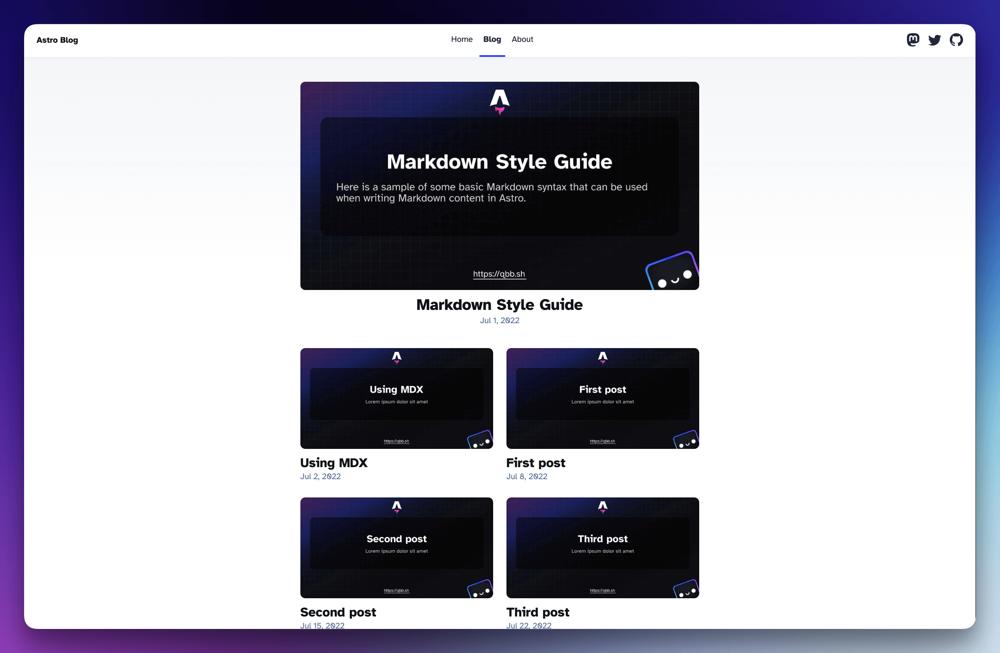
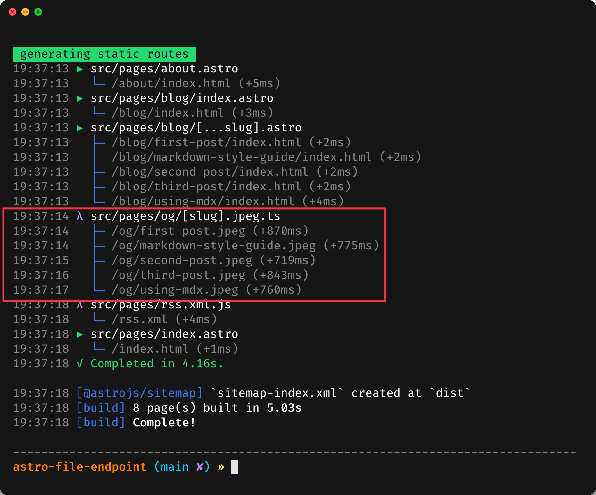

# x-satori - Astro file endpoints example

**Preview**: <https://satori-astro.vercel.app/blog/>

This example demonstrates how to use the Astro [file-endpoints](https://docs.astro.build/en/guides/endpoints/) to generate **posts cover image** and **Open Graph image**.



## Running example to local

```bash
npx degit Zhengqbbb/x-satori/examples/astro-file-endpoint <file_name>

cd <file_name>
npm install

# Development Image Template Model
npm dev:og

# Development Website
npm dev
# Build Website
npm build
# Preview Website
npm preview
```

## Get-Started

### 1. Install Dependencies

```bash
npm install -D x-satori @resvg/resvg-js jimp
```

- [x-satori](https://github.com/Zhengqbbb/x-satori) - Using Astro file (.astro) as template to generate image SVG.
- [@resvg/resvg-js](https://www.npmjs.com/package/@resvg/resvg-js) - Convert SVG to PNG.
- [jimp](https://www.npmjs.com/package/jimp) - Image optimization, compression, editing, cropping, etc.  This example mainly for **PNG to JPEG + quality compression**.

### 2. Create utils folder and files

[og](./src/og)

```sh
.
├── config.ts       # x-satori Configuration file - Provide for index.ts and x-satori dev CLI
├── index.ts        # Provide for Astro file-endpoints
└── Template.astro  # Astro file template - Provide for index.ts and x-satori dev CLI
```

> [!TIP]
> Can using `x-satori` CLI to create dev server to preview and design the template
> ```sh
> npm run dev:og
> ```

### 3. Create Astro [file-endpoints](https://docs.astro.build/en/guides/endpoints/)

 The example target is generate `dist/og/*.jpeg`.<br>
 So that touch a file `src/pages/og/[slug].jpeg.ts`

 ```ts
 import type { APIRoute } from 'astro'
import { type CollectionEntry, getCollection } from 'astro:content';
import { getPostImageBuffer } from '../../og';

export async function getStaticPaths() {
  const posts = await getCollection('blog');

    return posts
        .map(post => ({
            params: { slug: post.slug },
            props: { ...post },
        }));
}

export const GET: APIRoute = async ({ props }) =>
    new Response(
        await getPostImageBuffer(props as CollectionEntry<'blog'>),
        {
            headers: { 'Content-Type': 'image/jpeg' },
        },
    )
 ```

### 4. 🤗 That it! Have enjoy - Run `npm run build`




